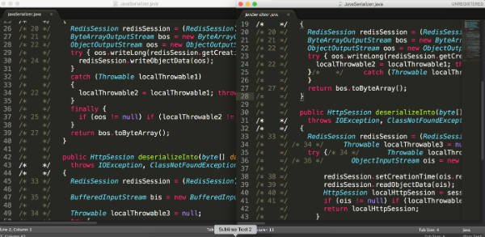

# jdgui-source-line-fixer
JDGUI outputs *.java files with messed up line numbers. This fixes the jdgui output.

Just download latest release, use jd-gui to output zip with sources, and then:
Usage: java -jar jdgui-lines-fixer.jar /path/to/source.zip /path/to/output.zip

Example of why I needed this:

On the left - the original source as outputed by JDGUI. On the right, after running java -jar jdgui-linex-fixer.jar /path/to/zip /path/to/outzip, the same file from the outzip.

  

